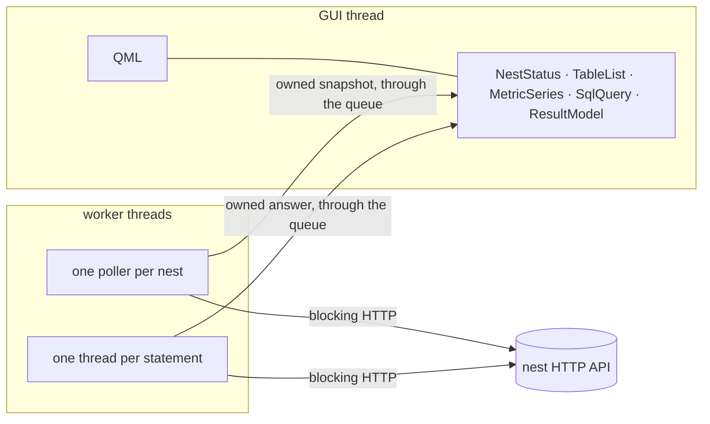

# RFC-0001: nuthatch-desk, a Qt desktop client for a nuthatch nest

2026-10-01 · pete

|  |  |
| --- | --- |
| Status | Accepted 2026-10-01. All seven slices are built and green in CI on Linux, macOS and Windows |
| Name | nuthatch-desk. Proposed as a working name and kept |
| Licence | MIT OR Apache-2.0, as the rest of the org |
| Depends on | A running nuthatch API, Qt 6.5 or newer, cxx-qt 0.10.0 |

The text from Summary to Open questions is the RFC as it was accepted, with two edits: the
dependency line above names the versions that were chosen, and each open question now carries its
answer. Everything the build changed or learned is in [As built](#as-built), at the end, so the
proposal and the result can be read apart.

## Summary

nuthatch-desk is a read-only desktop client for a running nuthatch nest, written in Rust with a
Qt 6 and QML front end bridged through cxx-qt. It keeps the contract of
[nuthatch-tui-client](https://github.com/nuthatch-org/nuthatch-tui-client): a client, not an
indexer, speaking only to the nest's HTTP API.

It adds the three things a terminal cannot hold: a SQL workbench with a real result grid, charts
with history, and several nests open at once.

It has a second purpose, stated plainly. It is a worked example of QObjects implemented in Rust
(properties, signals, invokables, item models), with the ownership and threading rules written down
and tested.

## Motivation

The TUI client at 0.2.0 answers the operator's questions in 100 columns by 31 rows, and it should
keep doing that on the nest's own host. Three questions do not fit in that space.

| Question | TUI today | nuthatch-desk |
| --- | --- | --- |
| What did this query return? | Newest rows of one table, columns dropped when they do not fit | Free-form SQL, full result in a scrolling, sortable grid, copy as CSV |
| What happened over the last hour? | Two sparklines, one bar per poll | Line charts with a kept history per metric |
| How do my nests compare? | One nest at a time; `n` and `N` switch and restart the dashboard | One tab per nest, each with its own poller |

This is an alternative for a workstation, not a replacement. The TUI stays the tool for an ssh
session.

The second motivation is the bridge itself. The org has no hand-written C++ interop anywhere, and a
Qt client is a contained place to do it properly.

## Goals and non-goals

Goals:

1. Parity with the TUI's health, sync, tables and performance panels for one nest.
2. A SQL workbench: run a statement against the nest's `/sql`, show the result in a sortable grid,
   copy it out as CSV.
3. Several nests in tabs, reading the same `nests.toml` the TUI reads, so one config serves both.
4. Every bridged QObject carries a rustdoc block naming its owner, its thread, and what may cross
   the boundary.
5. `cargo build` alone produces the binary on Linux and macOS. No CMake.
6. Windows on MSVC builds in CI. A stretch goal, taken last.

Non-goals:

- Writing anything. No config changes, no store access, no RPC key.
- Embedding nuthatch. The client never links the indexer.
- Qt Widgets, mobile targets, theming.
- Installers and signed binaries in the first version.
- Managing ssh forwards in the first slices. See open questions.

## Architecture

Three crates and one rule: only the Qt GUI thread touches a QObject.

QML binds to Rust QObjects on the GUI thread. Each nest gets one worker thread that polls over
blocking HTTP and hands owned snapshots back through cxx-qt's queue onto the GUI thread.

| Crate | Holds | Links Qt |
| --- | --- | --- |
| `nest-client` | HTTP types and the poller for `/ready`, `/nests`, `/sql`, the root document and the metrics endpoint | No |
| `desk-bridge` | The `#[cxx_qt::bridge]` modules and the Rust structs behind each QObject | Yes |
| `desk` | `main.rs`: starts the Qt application and loads the QML module from `desk/qml/` | Yes |

There is no async runtime. The TUI already uses blocking reqwest, and one thread per nest is enough
for a client that polls every 2 to 30 seconds.

Keeping `nest-client` free of Qt means its tests run anywhere, and the TUI could share it later.

## The bridge surface

Five QObjects cover the whole client. Each is registered as a QML element and created by QML, never
by Rust.

| QObject | Base | Properties | Signals | Invokables |
| --- | --- | --- | --- | --- |
| `NestStatus` | QObject | `url`, `state`, `partial`, `version`, `tip`, `indexed`, `sealed`, `sealGap`, `lagBlocks`, `pollIntervalSecs` | `restartSeen()`, `pollFailed(message)` | `connectTo(url)`, `refresh()` |
| `TableList` | QAbstractListModel | `count` |  | `select(row)` |
| `MetricSeries` | QAbstractListModel | `metric`, `windowSecs`, `peak` |  | `clear()` |
| `SqlQuery` | QObject | `running`, `error`, `elapsedMs`, `rowCount` | `finished()`, `failed(message)` | `run(sql)`, `cancel()` |
| `ResultModel` | QAbstractTableModel | `columnNames` |  | `copyCsv()` |

`state` mirrors the TUI header: live, attention, backfill, quarantined, stale. It is a Qt enum
declared in the bridge, so QML compares names and not strings.

The shape of one bridge, as a sketch. Exact attribute syntax is checked against the pinned cxx-qt
version in slice 0.

```rust
#[cxx_qt::bridge]
mod qobject {
    unsafe extern "C++" {
        include!("cxx-qt-lib/qstring.h");
        type QString = cxx_qt_lib::QString;
    }

    unsafe extern "RustQt" {
        #[qobject]
        #[qml_element]
        #[qproperty(QString, url)]
        #[qproperty(i64, tip)]
        #[qproperty(i64, sealed)]
        type NestStatus = super::NestStatusRust;

        #[qsignal]
        fn restart_seen(self: Pin<&mut NestStatus>);

        #[qinvokable]
        fn connect_to(self: Pin<&mut NestStatus>, url: &QString);
    }

    impl cxx_qt::Threading for NestStatus {}
}
```

Block heights cross as `i64`. Token amounts and other 256-bit values cross as strings, because a
QML number is a double and would round them.

## Ownership and safety rules

These eight rules are normative. A change that breaks one needs an amendment to this RFC.

1. **QML owns every bridged QObject.** The Rust struct lives inside the C++ object and drops with
   it. Rust never holds an owning pointer to a QObject.
2. **Workers hold a queue handle, nothing else.** A worker keeps the handle from `qt_thread()` and
   no reference or pointer to any Qt object.
3. **Only owned Rust values cross threads.** A poll produces a snapshot struct, and the queued
   closure moves it onto the GUI thread and sets properties there.
4. **Destruction never blocks the GUI thread.** Dropping the Rust struct sets a stop flag and
   detaches the worker. A queue call after destruction must fail cleanly, which slice 1 proves with
   a test.
5. **Models change only inside their reset or insert brackets.** `data()` never sees a
   half-written row set.
6. **QObjects are pinned.** Mutating methods take `Pin<&mut T>`. Unpinning is allowed in one
   audited module only.
7. **Every `unsafe` block carries a `// SAFETY:` comment.** CI denies
   `clippy::undocumented_unsafe_blocks` and `unsafe_op_in_unsafe_fn`.
8. **No panic crosses the boundary.** A panic in an invokable called from C++ aborts the process,
   so the bridge crate denies `unwrap_used` and `expect_used`, and worker bodies run under
   `catch_unwind`.

Rule 4 rests on a reading of the cxx-qt threading docs. It is the first thing to verify, not an
assumption to build on.

## Build engineering

`cargo build` is the whole build. `desk-bridge/build.rs` uses `cxx-qt-build` to run moc, compile the
generated C++ and register the QML module. There is no CMake and no hand-written C++ in the first
slices.

Qt is found through `qmake` on the path, or the `QMAKE` environment variable when several Qt
versions are installed.

| Target | Qt from | In CI from |
| --- | --- | --- |
| x86_64 Linux | Distribution packages (Qt 6 base and declarative) | Slice 0 |
| aarch64 macOS | Homebrew `qt` | Slice 0 |
| x86_64 Windows, MSVC | Official Qt installer | Slice 6 |

CI runs each target on every pull request: build, tests, `cargo fmt --check`,
`cargo clippy -- -D warnings`, `qmllint` over `desk/qml/`.

Two licensing facts shape the build:

- Qt is used under the LGPL and linked dynamically. Shipping binaries brings LGPL obligations, so
  the first version ships source only.
- Qt Charts and Qt Graphs appear to be GPL for open-source use, which does not fit
  MIT OR Apache-2.0. Charts are drawn in QML with `Canvas` or `Shape` instead. To be confirmed
  before slice 4.

## Testing and quality gates

Every change lands with a test, and the logic is kept where it can be tested without Qt.

| Layer | Test | Runs where |
| --- | --- | --- |
| `nest-client` | Unit tests over recorded response bodies from a real nest, including the 503 body of a stalled `/ready` | Everywhere, no Qt |
| Bridge logic | Each QObject's state transitions as plain Rust structs, tested without the bridge | Everywhere, no Qt |
| Bridge, live | Headless run with `QT_QPA_PLATFORM=offscreen` against a mock HTTP server: load the QML, wait one poll, assert properties | CI, Linux and macOS |
| Lifetime | Destroy a `NestStatus` while its worker is mid-poll. No crash, no leak, worker exits | CI, Linux and macOS |
| Parity | Same nest, TUI and desk side by side: heights, lag and state agree | Manual, per release |

Gates on every pull request: `cargo fmt --check`, clippy with warnings denied,
`#![deny(missing_docs)]` on `nest-client` and `desk-bridge`, `qmllint` clean.

## Threat model

The client trusts its user and its own binary. It does not trust the nest it reads, the network in
between, or the contents of `nests.toml`.

| Threat | Enters through | Mitigation |
| --- | --- | --- |
| A hostile or broken nest returns markup that QML renders as rich text | Any string property or model cell | Every `Text` is set to plain text. No string from a nest reaches a rich-text or URL-opening path |
| Oversized responses exhaust memory | `/sql` results, the root document | Body size cap and row cap in `nest-client`. The grid says when a result was cut |
| Large integers silently rounded | 256-bit values shown through QML numbers | Such values cross as strings. Only block heights and counters cross as `i64` |
| SQL built from nest-supplied names | Table preview queries | Table names are checked against a strict identifier pattern and quoted. Free-form SQL is only what the user typed |
| Use after free across the boundary | A worker outliving its QObject | Ownership rules 1 to 4, and the lifetime test |
| Data race on UI state | A worker writing a property directly | Ownership rules 2 and 3. Only queued closures write properties |
| Process abort from a Rust panic in C++ frames | Invokables and queued closures | Ownership rule 8 |
| Config file runs something | A crafted `nests.toml` | URL scheme limited to http and https. No command is built from config in the first slices |
| Plain HTTP to a remote nest read or altered in transit | A non-loopback http URL | A visible warning in the nest's tab. Remote nests are expected behind an ssh forward or TLS |
| Dependency tampering | Crates and the Qt install | Committed lockfile, `cargo-deny` in CI, Qt from the platform's own packages |

Out of scope: the correctness of the nest's data, and an attacker already running as the same local
user.

## Slices

Seven slices, each ending in something that runs. Slice 0 and 1 are the ones that prove the bridge.

| Slice | Delivers | Exit criterion |
| --- | --- | --- |
| 0 | Workspace, `build.rs`, a window showing one property set from Rust | `cargo run` opens the window on Linux and macOS, CI green on both |
| 1 | `NestStatus` live against a nest: state, heights, lag | Lifetime test passes. Numbers match the TUI on the same nest |
| 2 | `TableList`, selected table, live feed | A table model updating in place without a full reset on each poll |
| 3 | SQL workbench: `SqlQuery` and `ResultModel` | A statement runs, cancels, and reports a refused query as the nest worded it |
| 4 | `MetricSeries` and charts with kept history | An hour of history per metric at a stable memory footprint |
| 5 | Several nests in tabs from `nests.toml` | Two nests open, one stopped, the other unaffected |
| 6 | Windows on MSVC in CI | Build and headless test green on the third target |

## Open questions

Each as it was asked, then how it was settled.

- **The name. nuthatch-desk is a placeholder.**
  Kept, 2026-10-01.
- **Share `nest-client` with the TUI by extracting its HTTP code, or write it fresh? This draft
  was written from the TUI's README and manifest, not its source.**
  Ported from the TUI's `api.rs` and `worker.rs`, which are the same licence and the same org, into
  a library with a public, documented API. The TUI could now depend on it. It has not been made to.
- **The endpoint list. Confirm paths and shapes against nuthatch itself.**
  Confirmed against Nuthatch 3.13.3's `src/serve.rs` and a running nest. The draft's list was
  short by four: see As built.
- **ssh forwards: reuse the TUI's `ssh -N -L` approach, or leave forwarding to the user?**
  The TUI's approach, ported. The first build left forwarding to the user, and the first time it
  met a real `nests.toml`, in which every nest is behind ssh, it opened four tabs that showed
  nothing. See As built.
- **Minimum Qt 6 version, and the cxx-qt version to pin.**
  Qt 6.5, for `pragma ComponentBehavior: Bound`, which is what lets `qmllint` pass on delegates.
  That is the floor by design: what CI builds and tests against is 6.8.3, 6.10.2 and 6.11.2, and
  nothing older has been tried. cxx-qt 0.10.0.
- **Does a queue call after the QObject is destroyed fail cleanly? Ownership rule 4 depends on it.**
  Yes. `CxxQtThread::queue` returns `Err(ThreadingQueueError::ObjectDestroyed)`, and the
  `queue_after_destruction` scenario makes the call on purpose and checks it was refused.
- **Licence terms of Qt Charts and Qt Graphs, before slice 4.**
  Both are `GPL-3.0-only` for open-source use, where Qt Base and Qt Declarative are
  `LGPL-3.0-only`. Neither is used. Charts are drawn with `QtQuick.Shapes`, which is part of Qt
  Declarative.
- **Ship binaries under the LGPL's terms, or stay source only?**
  Source only. Unchanged.
- **Does this live in its own repository or beside the TUI?**
  Its own: `nuthatch-org/nuthatch-desk`.

## As built

What the build changed, and what it found. Written 2026-10-01 against the tree at the time.

### Five crates, not three

The testing table asks for "each QObject's state transitions as plain Rust structs, tested without
the bridge". They cannot be that inside `desk-bridge`, which links Qt to compile at all. So the
structs have a crate of their own.

| Crate | Holds | Links Qt |
| --- | --- | --- |
| `nest-client` | HTTP types, the poller, `nests.toml`, URL checks | No |
| `desk-core` | The state behind each QObject, and the poller threads | No |
| `desk-bridge` | The five `#[cxx_qt::bridge]` modules, each a thin copy from `desk-core` into properties | Yes |
| `desk` | `main.rs`, the QML, the headless tests | Yes |
| `mock-nest` | A stand-in nest for tests, serving recorded bodies over real HTTP | No |

### How two QObjects meet without holding each other

The RFC has one poller per nest and five QObjects, and does not say how a snapshot gets from the
one to the several. Rule 1 forbids the obvious answer, which is for one object to hold another.

Two mechanisms, both in `desk-core`, neither involving a pointer:

- **The feed hub** (`feed.rs`). Each object that shows a nest subscribes with a sink: a closure
  that takes an owned snapshot and queues it onto its own object. The poller for a URL knows the
  URL and a list of sinks. A sink that reports its object destroyed is dropped, and a poller with no
  sinks exits. `NestStatus`, `TableList` and every `MetricSeries` on one nest therefore share one
  thread and one poll.
- **The result store** (`results.rs`). A finished result is published under an integer key. The
  object that fetched it exposes the key as a property, and QML binds the model's key to it:
  `ResultModel { resultKey: query.resultKey }`. The same model type shows the SQL result and the
  table preview.



So there are more than the two threads the RFC drew: one poller per nest, and one short-lived
thread per SQL statement so that a slow statement delays nothing else.

### The endpoints

The draft named `/ready`, `/nests`, `/sql`, the root document and the metrics endpoint. The client
also reads `/tables` (the catalogue), `/nest` (name and chain), `/queries` (whether free-form SQL is
open), and `/schema` as a fallback for a nest too old to serve `/nest`.

`/sql` answers `{"rows": [{...}], "truncated", "degraded", "tip_unavailable", ...}` and takes a
`max_rows` parameter, which the client sends. A refusal is a 400 with `{"error": "..."}`, and that
text is what the client shows. The nest sends a row's fields in alphabetical order, so a free-form
result's columns are alphabetical whatever the statement said; the table preview puts its own back
in catalogue order.

### The bridge surface

All five objects grew. What each has now is in its rustdoc, which is the reference; the changes of
kind are these.

- **One notify signal per object for its read-only properties** (`changed`), since they all change
  together, once per poll.
- **`NestStatus`** also has `nestName`, `chain`, `hotRows`, `refreshMs`, `syncFraction`,
  `syncLabel`, `problems` and `insecure`. A height is `-1` where the nest has none to give.
- **`TableList`** has `url`, `selected`, `selectedTable`, `selectedRows`, `selectedLatestBlock`,
  `sqlOpen`, and `feedKey` for the preview's rows.
- **`MetricSeries`** has `url`, `count`, `latest`, `known`, and `polyline(width, height)`, which
  returns the line already scaled so QML draws it with one `PathPolyline`.
- **`SqlQuery`** has `url`, `notice` and `resultKey`.
- **`ResultModel`** has `resultKey`, `rows`, `sortColumn`, `sortDescending`, `sortBy(column)` and
  `clearSort()`. `copyCsv()` became `csv()`, which returns the text: cxx-qt-lib binds no clipboard,
  so QML does the copying.

### ssh forwards

The RFC made these a non-goal for the first slices and the threat model said no command is built
from config. Both gave way to the first real config file, on the day the client was first run.

The forward belongs to the nest's poller thread, which is where `ssh`'s connect time can be spent
without the window noticing. `NestStatus.connectVia(url, host)` subscribes; the poller runs
`ssh -N -L` with `BatchMode` and `ExitOnForwardFailure`, waits for the local end to listen, and
polls through it. Each snapshot says where it was polled, and `NestStatus.url` becomes that
address, so the table list, the charts and the SQL workbench follow it with no knowledge of ssh.
A forward that will not open, or drops, arrives as a snapshot carrying ssh's own last line, and
is retried with a doubling backoff. The poller's exit ends the `ssh` process.

Checked by hand against a live nest behind ssh. In the automated tests the hub is given a
stand-in forward, and the real tunnel is tested as far as it can be without a server to connect
to: argument order, refusals, a program that is absent, one that exits, one that hangs.

### The rules, as kept

- **Rule 4 is verified**, in CI on macOS with Qt 6.11.2, on Ubuntu 26.04 with its own Qt 6.10.2
  and on Windows with Qt 6.8.3: a queue call onto a destroyed QObject is refused. Destruction drops a `Subscription`, which takes the object's sink out of the poller's
  list under a lock held for microseconds and returns. Nothing is joined.
- **Rule 6 needed no audited module.** Nothing unpins. cxx-qt's `rust_mut()` is enough.
- **Rule 7:** the only `unsafe` in the tree is the model brackets, each pair inside one small
  helper with its reason.
- **Rule 8:** every invokable, setter and queued closure runs through `guard::contained`.
- **`cancel` abandons the answer, not the request.** HTTP has no way to call a statement back, so
  the nest finishes it and the reply is dropped on arrival.

### Added to the threat model

| Threat | Enters through | Mitigation |
| --- | --- | --- |
| A pasted result runs as a spreadsheet formula | A text cell beginning `=`, `+`, `-` or `@`, copied out as CSV | Such a cell is prefixed with an apostrophe, unless it is a plain number |
| A URL with a key in its query string appears in an error | reqwest's error text, which carries the full URL | The error's own text is never used: it is mapped to a fixed wording |
| One nest's figures shown under another's name | A `nests.toml` entry reached through ssh, polled with no forward open: its URL is then a port on this machine | Such a nest is polled only through a forward its own poller opened. Until that is up, `NestStatus.url` is empty and nothing bound to it polls anything |
| `ssh` is made to run something | An `ssh` host in `nests.toml` such as `-oProxyCommand=...` | The host is one argument to `ssh`, never a shell's. One that begins with a dash, or holds a space or a control character, is refused before `ssh` is run |

The first row of the RFC's table is tested twice over: one scenario shows that a default `Text`
does fetch a hostile nest's ``, and the next shows that the window does not.

### Found on the way

- **The TUI cannot read the `/ready` of a nest whose first poll failed.** That body has
  `"seconds_since_poll": null`, and the TUI declares the field `u64` with `#[serde(default)]`,
  which covers a missing field and not a null one. So the terminal client answers "unreadable
  response" for exactly the unhealthy state it exists to show. Recorded here from a 3.13.3 nest
  started against a dead RPC; the body is `mock-nest/fixtures/ready_503_stalled.json`.
- **A nest that has never polled reports tip 0 and lag 0**, which the TUI's sync gauge, ported
  faithfully, would have called "at tip" with a full bar. The desk says the nest has not polled
  its RPC yet. This is the one place its wording departs from the terminal client's on purpose.
- **Two bridges may not declare the same Qt base class.** cxx-qt emits a pair of cast helpers
  per declared `#[qobject]`, named after the type, so `QAbstractListModel` declared in both list
  models defined them twice. The macOS linker let it pass. GNU ld and lld refused, which is how
  it was found: on the first Linux build. The bases are now declared once, in
  `desk-bridge/src/bases.rs`.
- **`qmllint` earned its place** by catching a `scale` property on the chart that shadowed
  `Item.scale`.
- **Parity was run**, once, by hand: the TUI and the desk against the same 3.13.3 nest at the same
  moment agreed on state, tip, indexed, sealed, lag, seal gap and hot rows.

### Not done

- **A runtime's root.** Pointed at one, the client says what it mounts and asks to be pointed at a
  nest. It does not open the tabs itself.
- **`decimals` in `nests.toml`** is read so the file parses, and not applied. Amounts show in base
  units.
- **Windows beyond CI.** Slice 6's criterion is met: the MSVC build and the headless tests are
  green on `windows-2025` with Qt 6.8.3. Nobody has run the client on a Windows desktop, and the
  config path there (`%APPDATA%\nuthatch-tui\nests.toml`) is untested.
- **The window under a person's hands.** Every scenario drives the objects and reads what they
  show; none clicks. Header clicks, the tab close button, the run shortcut and the look of the
  thing on a real display are checked by eye or not at all.
